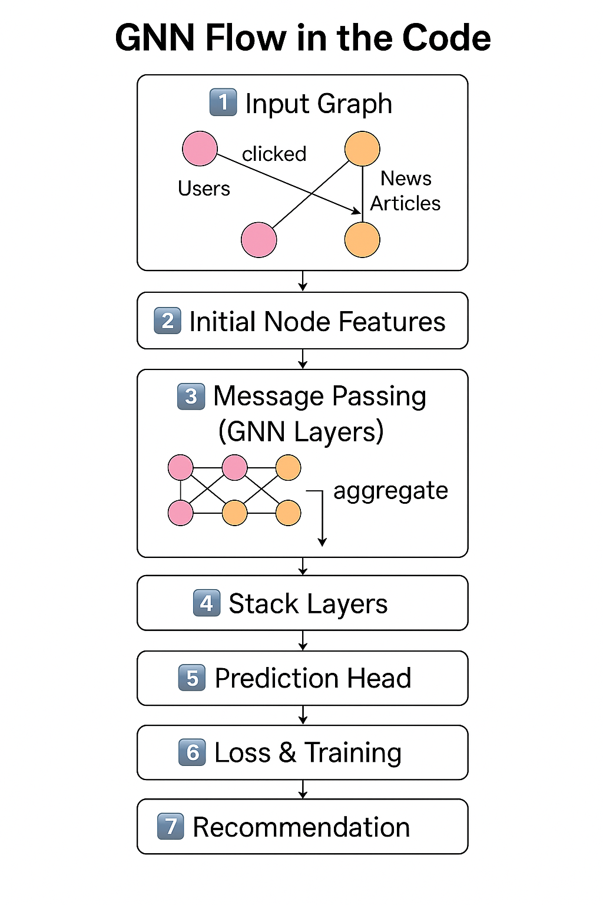

<h1 align="center">📰 News Recommendation with GNN</h1>

<h2 align="center">📹 Demo Video</h2>

<p align="center">
  🎥 <a href="media/demo.mp4" download>Click here to download and watch the quick demo</a>
</p>

<p align="center">
  <i>🚧 Demo video will be updated shortly.</i>
</p>

<h2 align="center">🎙️ Colab Walkthrough</h2>

<p align="center">
  📖 <a href="media/walkthrough.mp4" download>Click here to download and watch the full Colab explanation</a>
</p>

<p align="center">
  <i>🚧 Walkthrough video will be updated shortly.</i>
</p>

<h2 align="center">🗂️ GNN Flow Diagram</h2>

<p align="center">
  
</p>

<p align="center">
  <i>This diagram shows the step-by-step flow of how the recommendation works: 
  from input graph to message passing and final recommendations.</i>
</p>

---

<h2>🚀 Features</h2>

<ul>
  <li>✅ Toy dataset of users, news articles, and interactions</li>
  <li>✅ Graph construction with PyTorch Geometric</li>
  <li>✅ Basic GNN model for learning and recommendations</li>
  <li>✅ Clear Colab notebook with explanations</li>
</ul>

---

<h2>📦 Installation</h2>

```bash
pip install torch torch-geometric pandas
